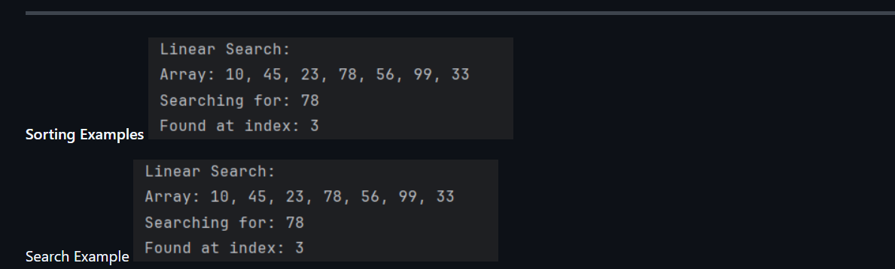
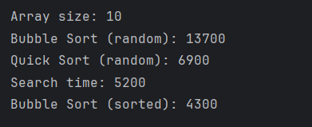
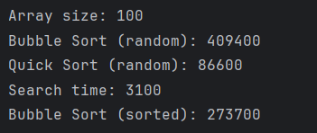
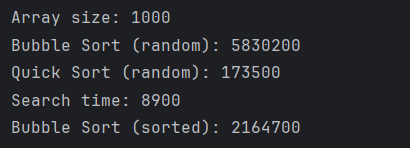

# Assignment 3: Sorting and Searching Algorithm Analysis

## A. Project Overview
In this project, I implemented and compared different sorting and searching algorithms. The goal was to analyze their performance using execution time.

I used:
- Bubble Sort (basic sorting)
- Quick Sort (advanced sorting)
- Linear Search (searching algorithm)

---
## B. Algorithm Descriptions

### Bubble Sort
Bubble Sort compares adjacent elements and swaps them if needed. It repeats this process until the array is sorted.

Time Complexity: O(n²)

---

### Quick Sort
Quick Sort selects a pivot element and divides the array into smaller parts. It then recursively sorts those parts.

Time Complexity: O(n log n)

---
### Linear Search
Linear Search checks each element one by one until it finds the target.

Time Complexity: O(n)

---
## C. Experimental Results

I tested arrays of different sizes:
- Small (10 elements)
- Medium (100 elements)
- Large (1000 elements)

I used:
- Random arrays
- Sorted arrays
### Observations:
- Quick Sort is much faster than Bubble Sort on large arrays
- Bubble Sort becomes very slow as size increases
- Sorted arrays improve Bubble Sort performance
- Search time remains small for Linear Search

---
## D. Screenshots

### Demo (before and after sorting)

### Experiment runs

***

## E. Analysis

During this assignment, I noticed that on small arrays (size 10), Bubble Sort can sometimes be competitive because it has low overhead.

However, on larger arrays, Quick Sort is much faster than Bubble Sort. This matches the theory, because Quick Sort has O(n log n) complexity while Bubble Sort has O(n²).

I also noticed that sorted arrays improve Bubble Sort performance because fewer swaps are needed.

Linear Search remains simple but inefficient for large arrays since it checks each element one by one.

---

## F. Reflection

In this assignment, I learned how different algorithms perform in practice. I saw that Bubble Sort is simple but inefficient for large data, while Quick Sort is much faster.

I also learned how to measure execution time using System.nanoTime().

The most difficult part was understanding Quick Sort and recursion.